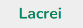
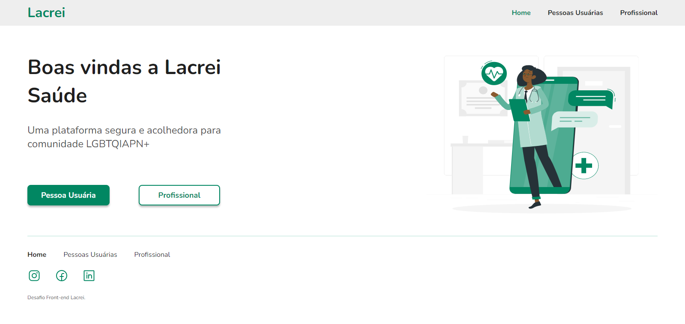
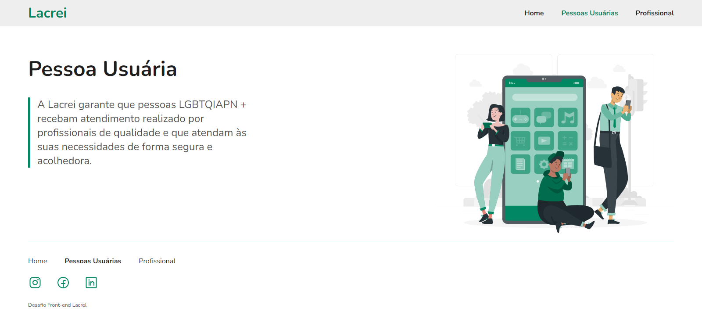

#  🏳️‍🌈 Desafio-Lacrei 🏳️‍🌈

<h1 align="center">
  
</h1>

<h1 align="center">
  
</h1>

<h1 align="center">
  
</h1>

<h1 align="center">
  
</h1>

## 🚀 Tecnologias

Esse projeto foi desenvolvido com as seguintes tecnologias:

  - React
  - Vite
  - React Router Dom
  - Styled Components
  - CSS 
  - HTML
  - JS

## 💻 Projeto

Desafio Lacrei prosposto para partcipar do projeto de voluntariado.
  - Quem é a Lacrei ? 
  - O Lacrei é o primeiro portal criado para conectar a comunidade LGBTQIA+ a profissionais de saúde, advogades e empresas que respeitam a diversidade oferecendo oportunidades de trabalho e desenvolvimento profissional.  
Conheça mais pelos links: 
  -  [Portal Lacrei](https://www.portallacrei.com.br/)
  - [Linkedin](https://www.linkedin.com/company/lacrei/?originalSubdomain=br )
    
                             
                                                                   

## 🔖 Layout
Você pode visualizar o projeto  através [desse link](https://desafio-lacrei-c2dy.vercel.app/).
